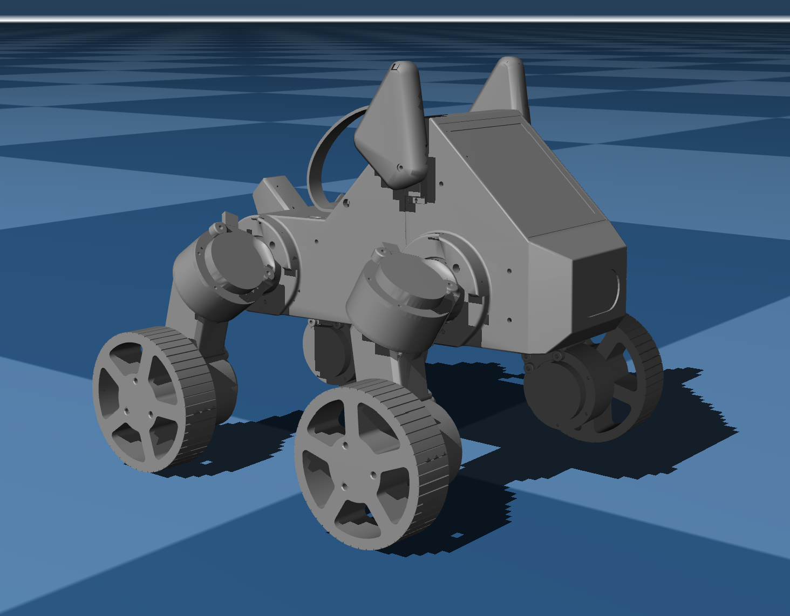

# Wheeled Pupper v3 Digital Twin – MuJoCo & ROS Description

**High-fidelity mechanical description and simulation assets for the Wheeled Pupper v3 hybrid robot.**


*MuJoCo simulation render of the Wheeled Pupper v3, featuring custom wheel actuators and modified kinematics.*

## Overview

This repository houses the **Digital Twin** and mechanical description files (URDF, MJCF) for the Wheeled Pupper v3. It serves as the single source of truth for the robot's kinematics, utilized across:
1.  **Reinforcement Learning**: High-performance MuJoCo MJX environments for gait training.
2.  **ROS 2**: Real-time state estimation and visualization.
3.  **Physical Hardware**: Fabrication-ready specifications for the shape-memory polymer morphing shin design.

## Key Features

### 🔧 Mechanical Modeling & CAD
- **SolidWorks to URDF Pipeline**: Automated export and cleaning of complex geometries to standard URDF format.
- **Hybrid Kinematics**: Modified the standard quadrupedal chain to support **continuous rotation joints** at the end-effectors (wheels) while retaining 12-DoF reconfiguration capabilities.
- **Inertial Accuracy**: Precise mass and inertia tensors derived from CAD for realistic Sim-to-Real dynamics transfer.

### ⚡ Actuator Dynamics (Split Control)
Unlike standard position-controlled robots, this description implements a **Hybrid Action Space**:
*   **Leg Joints (Hips/Thighs)**: High-stiffness **Position Control** (impedance) for stance stability.
*   **Wheel Joints**: Low-damping **Velocity/Torque Control** for efficient rolling locomotion.


*Visualization of the joint hierarchies and range-of-motion limits.*

## Repository Structure

```
├── description/
│   ├── mujoco_xml/      # Optimized XMLs for MJX/Gym (Wheel_pupper.xml)
│   ├── urdf/            # ROS 2 compatible descriptions
│   └── meshes/          # Visual and collision assets
├── scripts/             # Utilities for URDF cleaning and MJCF composition
└── launch/              # ROS 2 launch files for RViz visualization
```

## Quick Start (Visualization)

### MuJoCo (Physics Sim)
To view the model and physics properties:
```bash
# Verify the XML structure
python3 -m mujoco.viewer --mjcf=description/mujoco_xml/Wheel_pupper.xml
```

### ROS 2 (Kinematics)
To visualize the URDF in RViz:
```bash
colcon build
source install/setup.bash
ros2 launch pupper_v3_description display_model.launch.py
```

## Integration with RL

This description is directly consumed by the [Training Repository](https://github.com/TundTT/colab_Wheel_pupperv3). The `Wheel_pupper.xml` defines:
- **Sensors**: IMU, joint encoders, frame velocities.
- **Actuators**: Custom gain (`kp`) and damping (`kv`) profiles for the hybrid transmission.
- **Collision Geometries**: Optimized primitives for fast GPU-based contact detection in Brax/MJX.

## Acknowledgments
*   **UW–Madison LeggedAI Lab**: For support in hardware verification.
*   **Stanford Student Robotics**: Original Pupper v3 mechanical baseline.

---
**Author**: [Tund Theerawit](https://www.linkedin.com/in/tund-theerawit) | [GitHub](https://github.com/TundTT)